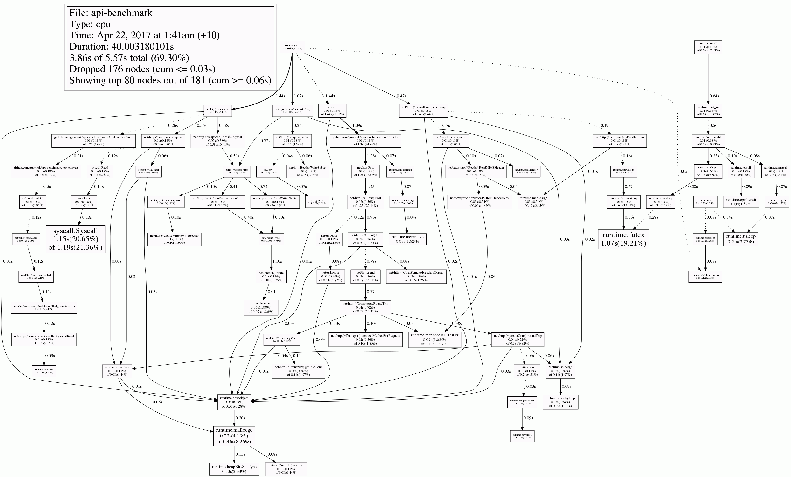
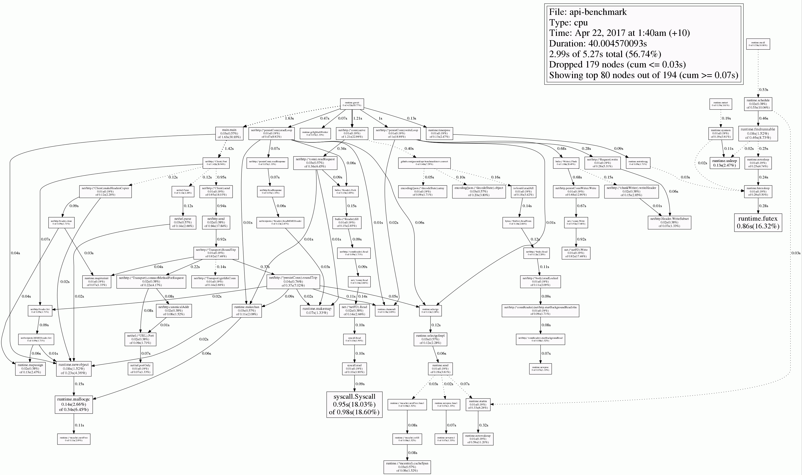
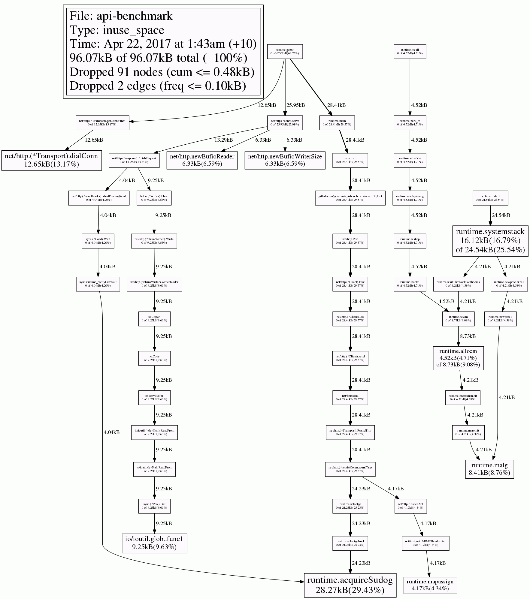
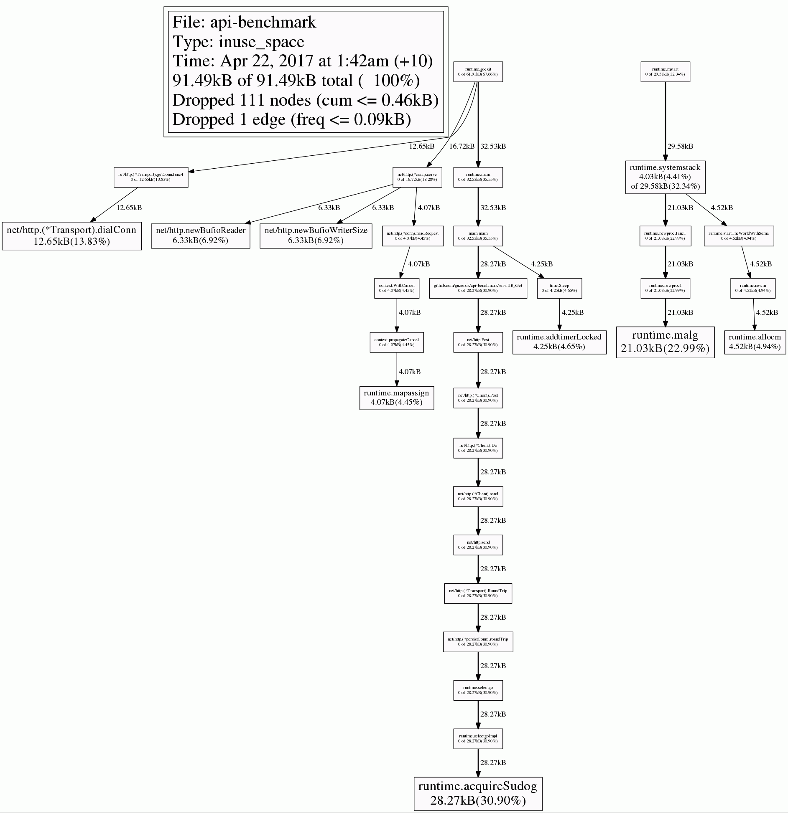

# API benchmark


## Run benchmarks:

```cd ./serv/; go test -bench "Bench*"; cd -``` get (for example):

```
BenchmarkHttp/API(Gin+Standart)-4         	   10000	    104354 ns/op
BenchmarkHttp/API(Gin+Buger)-4            	   20000	     89572 ns/op
BenchmarkHttp/API(Chi+Standart)-4         	   20000	     86178 ns/op
BenchmarkHttp/API(Chi+Buger)-4            	   20000	     91576 ns/op
BenchmarkDecode/Standart-4                	  200000	      6992 ns/op
BenchmarkDecode/Buger-4                   	  500000	      2162 ns/op
```

, where

  - "BenchmarkHttp/..." - tests specific http-server with specific json-parser
  - "BenchmarkDecode/..." - tests specific json-parser only


## PProf

(see gen_pprof_pictures.sh for details)

buger/jsonparser CPU profile


standart encoding/json CPU profile


buger/jsonparser Mem profile


standart encoding/json Mem profile


